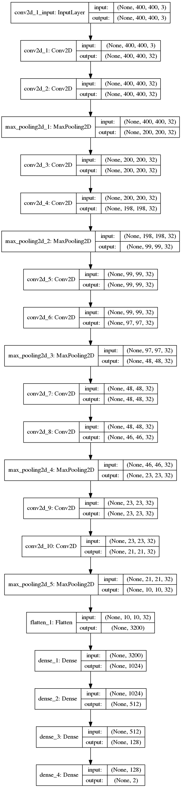

## Self Driving Car Nano-degree Capstone Project

This is the project repo for the final project of the Udacity Self-Driving Car Nanodegree: Programming a Real Self-Driving Car. For more information about the project, see the project introduction [here](https://classroom.udacity.com/nanodegrees/nd013/parts/6047fe34-d93c-4f50-8336-b70ef10cb4b2/modules/e1a23b06-329a-4684-a717-ad476f0d8dff/lessons/462c933d-9f24-42d3-8bdc-a08a5fc866e4/concepts/5ab4b122-83e6-436d-850f-9f4d26627fd9).


### Introduction

The goal of this project is do program a real self-driving car. The self driving car has three modules: 1) Perception, 2) Planning, and 3) Control. We were required to program in all three modules to make the car autonomous. In order to work in these three module, we had to code in waypoint_updated.py (Planning), tl_detector.py (Perception), and dbw_node.py (Control). The car will run in the given track while following the given waypoints. The car have to obey the traffic signals and update the waypoints accordingliy. The following figure shows the indetails module archtecture of the autonomous vehicle:


#### Perception

In the perception module the camera placed in the car captures the image of the traffic signal infront of the car. We have developed a Deep learning based CNN model that can classify the traffic signal status. This is the steps we followed to develop the traffic signal classifier:

##### Data Collection

We have collected the from the simulator and used that data to train the classifier. The collected data was manully classified into red and not-red. and placed the images in following structue for training: 

```
data
└───train
│   │───red
│       │   1.jpg
|       |   ...
│   │   notred
│       │   1.jpg
|       |   ...
└───val
│   │───red
│       │   1.jpg
|       |   ...
│   │───notred
│       │   1.jpg
|       |   ...
```

##### Traffic Signal Classifier Model

I have tried with different models and used transfar learning to retrain the model. First I tried to use the vgg16 mode. But It failed due to the bigger size of vgg16 (~2.5GB). Then I tried to use a lightweight model MobileNet and retrained it using the our dataset. But the MobilenNet but it only supports a maximum size of (224,224) as input. Thus, it failed to deteted the traffic signals accurately in the simulation. Then I modified the VGG16 structure to reduce the network size and finally came up with the following structure: 




After the model developemnt, the script in ```/tl_detector/light_classification/train.ipynub``` is the script that we used for training the model. We have used data augmentation to create more data using ```ImageGenerator``` in keras. Here is the code spippit: 
```
train_datagen = ImageDataGenerator(rescale = 1./255,
                                   horizontal_flip = True,
                                   fill_mode = "nearest",
                                   zoom_range = 0.3,
                                   width_shift_range = 0.3,
                                   height_shift_range=0.3,
                                   rotation_range=30)
```
Finally we came up with the trained model ```/tl_detector/light_classification/model.h5``` that we used to classify the traffic signal light status. 

##### 

#### Planning

The planning module is located in ```waypoint_updated.py``` where traffic signal status information and predefined waypoints of the car is located. Based on the traffic signal status, the vehicle accelerate or decelarate or keep follwoing the current target waypoints. 

#### Control

The control module of the car is located in ```dbw_node.py``` which in co-operation with the scripts ```yaw_controller.py```, ```twist_controller.py``` , and ```pid.py``` controls the vehicle through the Drive-by-wire (DBW) interface. This control module provides control commands to the vehicle such as throttle, break, and steering commands. Upon getting the command the vehicle in simulator moves accordingly. 

### Installation 

Please use **one** of the two installation options, either native **or** docker installation.


### Native Installation

* Be sure that your workstation is running Ubuntu 16.04 Xenial Xerus or Ubuntu 14.04 Trusty Tahir. [Ubuntu downloads can be found here](https://www.ubuntu.com/download/desktop).
* If using a Virtual Machine to install Ubuntu, use the following configuration as minimum:
  * 2 CPU
  * 2 GB system memory
  * 25 GB of free hard drive space

  The Udacity provided virtual machine has ROS and Dataspeed DBW already installed, so you can skip the next two steps if you are using this.

* Follow these instructions to install ROS
  * [ROS Kinetic](http://wiki.ros.org/kinetic/Installation/Ubuntu) if you have Ubuntu 16.04.
  * [ROS Indigo](http://wiki.ros.org/indigo/Installation/Ubuntu) if you have Ubuntu 14.04.
* [Dataspeed DBW](https://bitbucket.org/DataspeedInc/dbw_mkz_ros)
  * Use this option to install the SDK on a workstation that already has ROS installed: [One Line SDK Install (binary)](https://bitbucket.org/DataspeedInc/dbw_mkz_ros/src/81e63fcc335d7b64139d7482017d6a97b405e250/ROS_SETUP.md?fileviewer=file-view-default)
* Download the [Udacity Simulator](https://github.com/udacity/CarND-Capstone/releases).

### Docker Installation
[Install Docker](https://docs.docker.com/engine/installation/)

Build the docker container
```bash
docker build . -t capstone
```

Run the docker file
```bash
docker run -p 4567:4567 -v $PWD:/capstone -v /tmp/log:/root/.ros/ --rm -it capstone
```

### Port Forwarding
To set up port forwarding, please refer to the [instructions from term 2](https://classroom.udacity.com/nanodegrees/nd013/parts/40f38239-66b6-46ec-ae68-03afd8a601c8/modules/0949fca6-b379-42af-a919-ee50aa304e6a/lessons/f758c44c-5e40-4e01-93b5-1a82aa4e044f/concepts/16cf4a78-4fc7-49e1-8621-3450ca938b77)

### Usage

1. Clone the project repository
```bash
git clone https://github.com/udacity/CarND-Capstone.git
```

2. Install python dependencies
```bash
cd CarND-Capstone
pip install -r requirements.txt
```
3. Make and run styx
```bash
cd ros
catkin_make
source devel/setup.sh
roslaunch launch/styx.launch
```
4. Run the simulator

### Real world testing
1. Download [training bag](https://s3-us-west-1.amazonaws.com/udacity-selfdrivingcar/traffic_light_bag_file.zip) that was recorded on the Udacity self-driving car.
2. Unzip the file
```bash
unzip traffic_light_bag_file.zip
```
3. Play the bag file
```bash
rosbag play -l traffic_light_bag_file/traffic_light_training.bag
```
4. Launch your project in site mode
```bash
cd CarND-Capstone/ros
roslaunch launch/site.launch
```
5. Confirm that traffic light detection works on real life images
